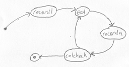
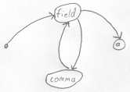
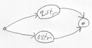
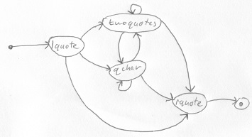

# CSV Parser Example

Loads a csv file and outputs it to the console. Rules taken from the [wiki](https://en.wikipedia.org/wiki/Comma-separated_values).

## Diagrams

### Main

### Record

### Field

### SStr

### QStr

